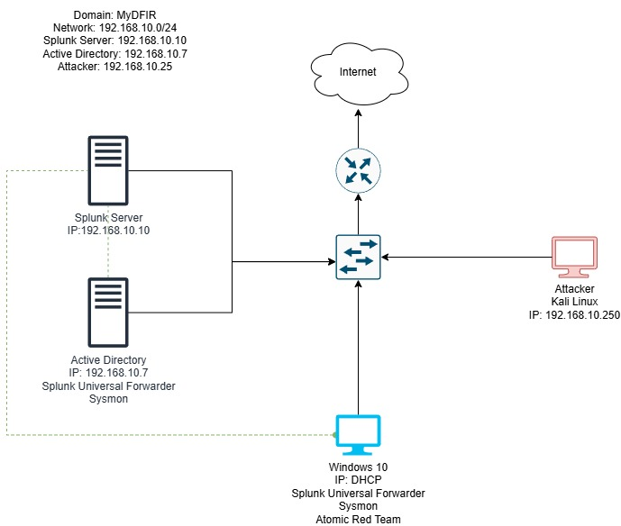

# ActiveDirectory
Active Directory Home Lab, using Splunk, Kali Linux, &amp; Atomic Red Team
## Topology 

*Figure 1: Network topology diagram showing Splunk Server, Active Directory, Windows 10 client, and Kali Linux attacker machine*
